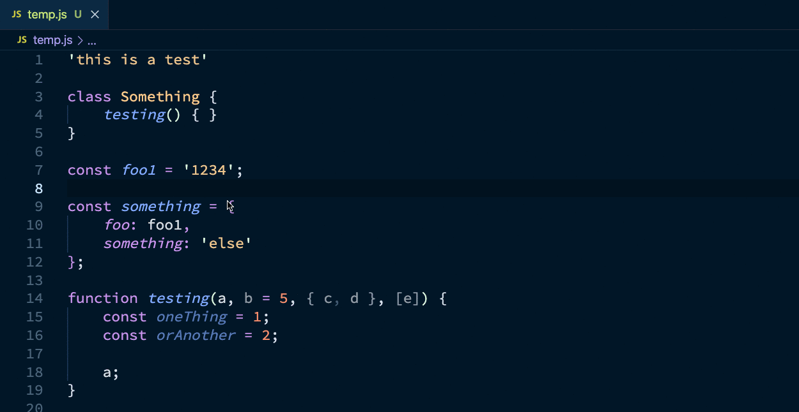
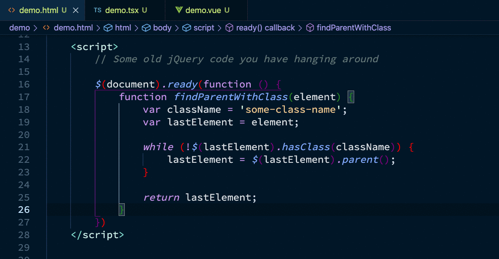
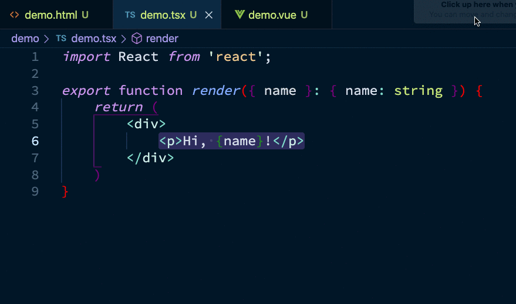
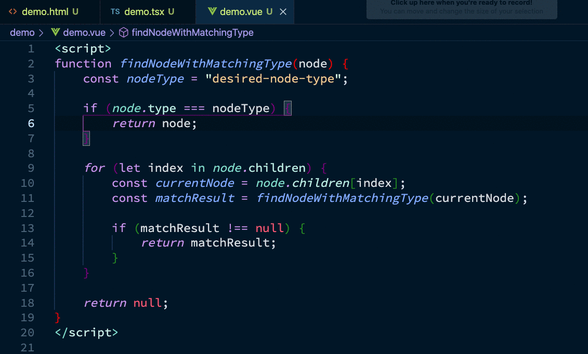
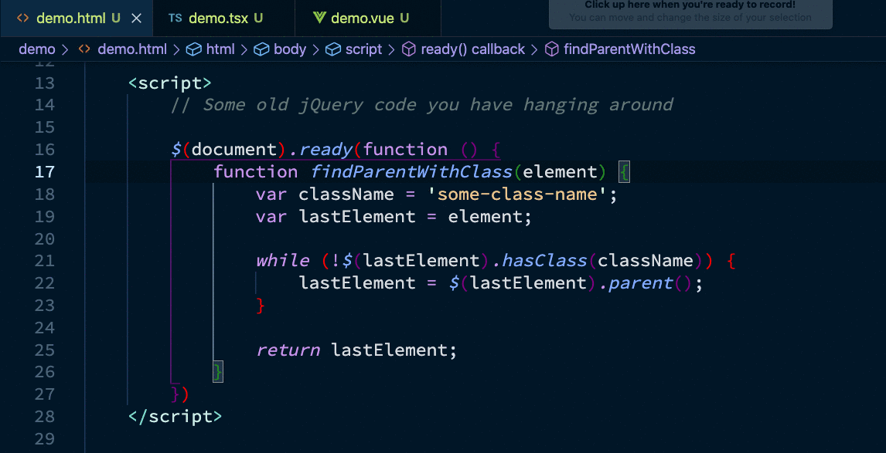
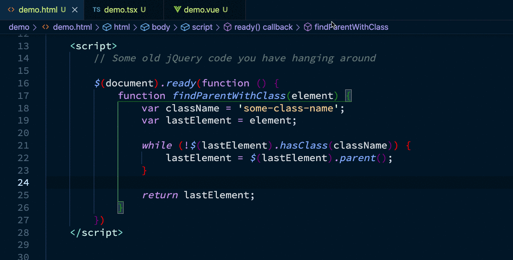
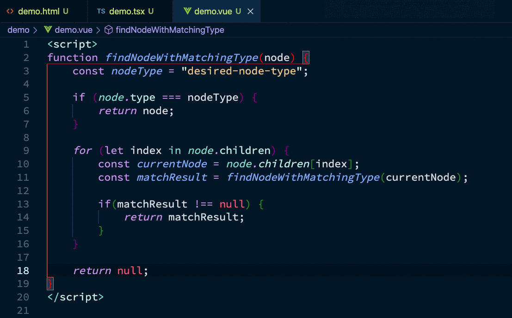

# JS CodeFormer: Javascript Refactoring & Code Automation #

## What and Why ##

JS CodeFormer is a JS refactoring and code automation extension for VS Code. Born from the ashes of JS Refactor, JS CodeFormer answers a new question. Instead of asking "can a JS refactoring tool be made for VS Code", this project aims to answer "how can better tools help to create better software?"

JS CodeFormer is a suite of tools purpose built to simplify the process of creating and editing software in a JavaScript environment.

## Core Principles ##

JS CodeFormer is not just a code refactoring and automation extension, it is an extension which is built upon these core principles:

- **Robustness** -- JS CodeFormer must work reliably and predictably in a broad range of code environments and styles
- **Communication** -- If JS CodeFormer fails, it should provide immediate feedback to the user; the feedback should be as clear as possible
- **Usability** -- It should be easy to find your way around the tool, even at the start
- **Accessibility** -- Clear, direct access to the tooling must be supported for all users regardless of disability 

None of these principles can be treated as "set it and forget it". Every new behavior, and every improvement receives serious thought as to how it will serve, and impact the developer using this tool.

## Goals ##

A goal in this project is to have it "just work". In other words, in any situation where it seems it should work, it does work. Since nobody is able to see the future, this is something which will need to be addressed as new situations arise.

### What it Looks Like ###

Currently, JS CodeFormer quietly works in files which reach beyond what is generally considered "standard JavaScript/TypeScript environments". Many extensions do not work in a LiveShare session, but JS CodeFormer is built to support a rich editing experience in an environment where many extensions are disabled.

### In Brief ###

JS CodeFormer does the following so support "it just works":

- Full functionality in HTML files
- Support for HTML-like environments like:
    - Vue single-file components
    - Svelte files
- Support for working in a Live Share session

## Language Support ##

The core languages in this list have been tested through active production use of the extension. Frameworks have been, at the least, smoke-tested on example production code.

Languages:

- JavaScript
- TypeScript
- HTML (Embedded Javascript)

Frameworks:

- Angular
- React
- Vue

Framework-specific formats:

- JSX
- TSX
- Vue Single-file components
    - Full Vue support requires the Vetur extension: https://marketplace.visualstudio.com/items?itemName=octref.vetur

Experimental framework support:

- Svelte -- requires the Svelte extension to work
    - https://marketplace.visualstudio.com/items?itemName=svelte.svelte-vscode

## Refactorings, Conversions, and Actions ##

JS CodeFormer has a number of automated code actions you can take. They are separated into the following categories:

- Refactorings: actions which meet Martin Fowler's definition of a refactoring
- Conversions: Conversion of common structures from one common form to another
- Actions: A variety of other automated behaviors useful for making common changes

For a top-level menu of all options, you can open the JS CodeFormer actions palette. This is available by the following key combinations:

- Windows: `ctrl+shift+j, ctrl+shift+j`
- Mac: `cmd+shift+j, cmd+shift+j`

### Suggested Actions ###

JS CodeFormer can suggest actions you can take given the current state of the document. By analyzing the document, cursor position, and selection state, you can get a list of actions possible right now.

To get suggestions, use the following key combination:

- Windows: `ctrl+alt+.`
- Mac: `cmd+shift+alt+.`

Here's what it looks like in action:

### Refactorings ###

JS CodeFormer automated refactorings are built upon years of experience to be stable and reliable. Though the project is new, and issues will inevitably arise, the tools in this project are used to support the project itself. In essence, JS CodeFormer is a self-dogfooding project.

Current refactorings:

- Extract Method/Function
    - Windows: `ctrl+shift+j, m`
    - Mac: `cmd+shift+j, m`
- Extract Variable to Parameter
    - Windows: `ctrl+shift+j, p`
    - Mac: `cmd+shift+j, p`
- Extract Variable
    - Windows: `ctrl+shift+j, v`
    - Mac: `cmd+shift+j, v`
- Inline Variable
    - Windows: `ctrl+shift+j, i`
    - Mac: `cmd+shift+j, i`
- Invert If Statement
    - Windows: `ctrl+shift+j, n`
    - Mac: `cmd+shift+j, n`
- Rename (important for non js/ts files) [See known issues]
    - Windows: `ctrl+shift+j, r`
    - Mac: `cmd+shift+j, r`

### Conversions ###

Conversions may or may not introduce a different behavior. This means they are in a class of their own. The following conversions are currently available:

- Select Conversion
    - Windows: `ctrl+shift+j, c`
    - Mac: `cmd+shift+j, c`
- Change Variable Type
- Convert Expression to Template Literal
- Convert Function to Arrow Function
- Convert Function to Function Expression
- Convert Function Property to Method
- Convert Function Variable to Function Declaration
- Convert Ternary to If/Else [See known issues]
- Toggle Arrow Function Braces
- Toggle Function Call Arguments Between Positional and Object Style
- Toggle Function Parameters between Positional and Object Destructuring Style
- Toggle Property Declaration Between Standard and Shorthand

### Actions ###

Not everything we want to do with our code is a refactoring. That doesn't mean we can't automate it. Actions aim to pair with the supported refactorings in order to provide a smooth development experience.

Current Actions:

- Select Action
    - Windows: `ctrl+shift+j, a`
    - Mac: `cmd+shift+j, a`
- Surround with (open options list)
    - Windows: `ctrl+shift+j, w`
    - Mac: `cmd+shift+j, w`
- Introduce variable
- Introduce function
- Lift and name function expression

### Snippets ###

VS Code comes with a number of basic snippets for generating common code. JS CodeFormer adds a few while trying to limit snippet overlap. This means the snippet selection will be enhanced rather than repeated.

Current Snippets:

- Variable
- Parameter
- Function (enhanced to support async and generators)
- Arrow Function
- Promise then
- Promise catch
- Try/Catch
- Constructor
- Function call
- Template Literal
- Immediately Invoked Function Expression (IIFE)

## Refactorings In Action ##

**Extract Method**

Using extract method in old jQuery, embedded in HTML:

Using extract method in a JSX block:

**Extract Variable**

Extract variable in a Vue single-file component:

**Extract to Parameter**

Extract to parameter in old jQuery, embedded in HTML:

**Inline Variable**

Inline variable in old jQuery, embedded in HTML:

**Rename**

Rename in a Vue single-file component:

## Contributors and Thanks #

Code contributions help introduce new behaviors and improve existing behaviors materially. I'd like to thank these contributors for their code contributions:

- [Jason Kerney](https://github.com/jason-kerney)

It's important to understand that not all contributions to a project are, or can be committed to the source repository. With that in mind, the following are people who have provided help and insights which might not have a name on a commit:

- [Jenn Zenk](https://github.com/jzenk) -- Accessibility feedback
- [Ashlee Boyer](https://twitter.com/AshleeMBoyer) -- Accessibility feedback

Also, every person who submitted a bug or enhancement on JS Refactor, and those who offer them on this project!

## Find Me ##

The best place to find me is on Twitter: [@cm_stead](https://twitter.com/cm_stead)
You can also find me on the web: [ChrisStead.net](http://chrisstead.net/)

## Known/Expected Issues ##

Rename:

- Renaming variables do not propagate to template HTML in Vue and Svelte

Convert Ternary to If/Else Statement:

- Currently only supports return statements and variable assignments